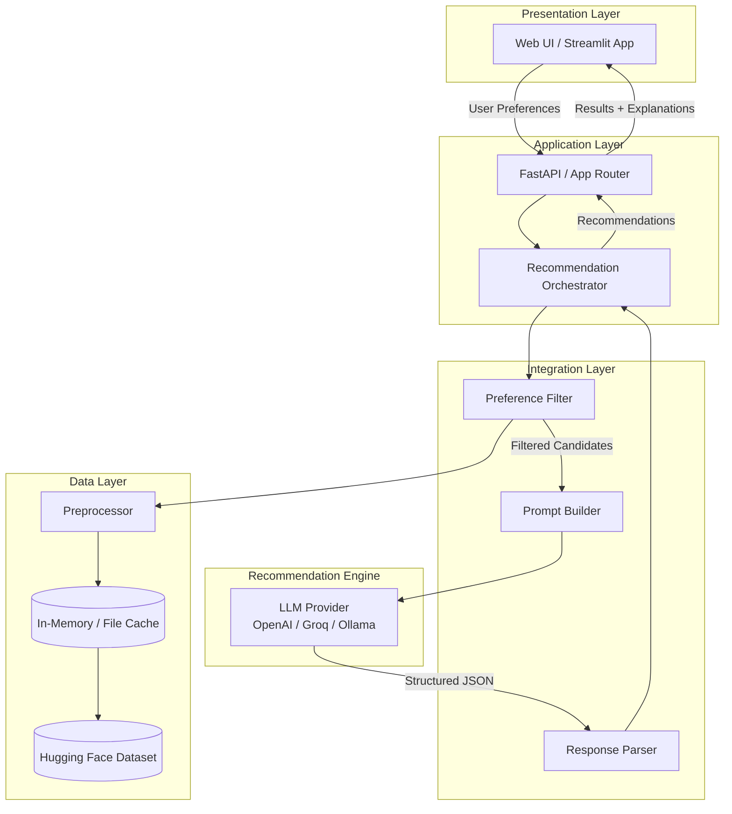
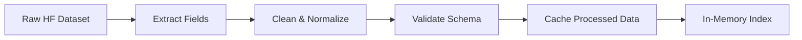
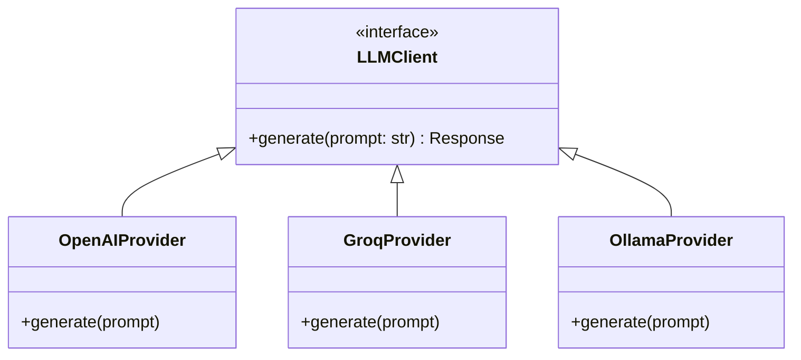
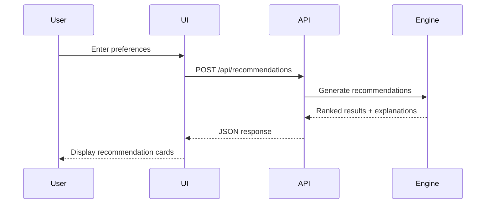
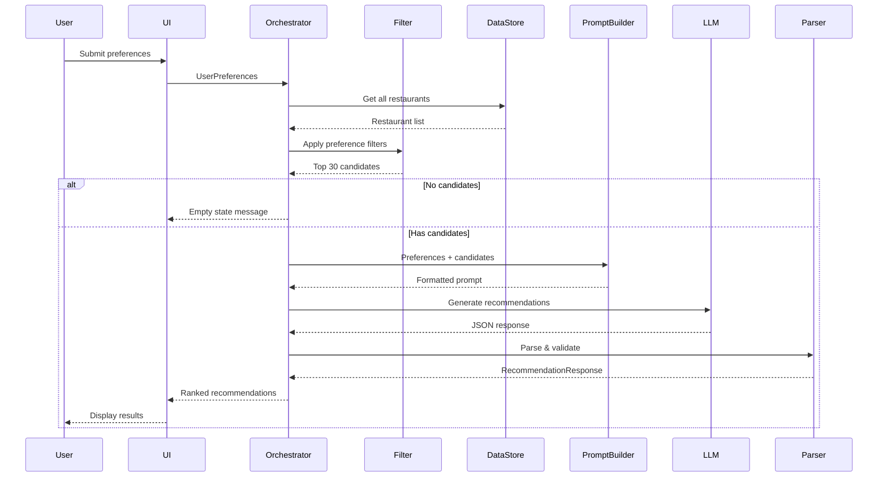
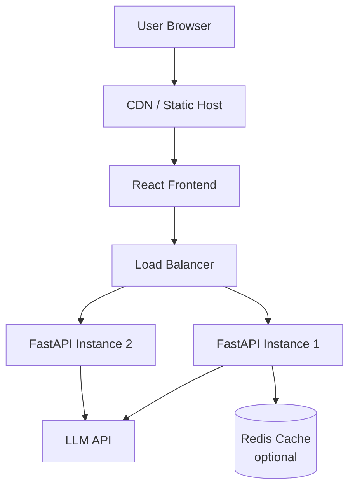

# Architecture: AI-Powered Restaurant Recommendation System

This document defines the technical architecture for building the Zomato-inspired restaurant recommendation service described in [problem_Statement.md](./problem_Statement.md). The system combines structured restaurant data with LLM-based reasoning to deliver personalized, explainable recommendations.

---

## Table of Contents

1. [Architecture Overview](#1-architecture-overview)
2. [Design Principles](#2-design-principles)
3. [High-Level System Diagram](#3-high-level-system-diagram)
4. [Component Architecture](#4-component-architecture)
5. [Data Architecture](#5-data-architecture)
6. [LLM Integration Architecture](#6-llm-integration-architecture)
7. [API Design](#7-api-design)
8. [Frontend Architecture](#8-frontend-architecture)
9. [Project Structure](#9-project-structure)
10. [Technology Stack](#10-technology-stack)
11. [End-to-End Data Flow](#11-end-to-end-data-flow)
12. [Prompt Engineering Design](#12-prompt-engineering-design)
13. [Error Handling & Resilience](#13-error-handling--resilience)
14. [Security Considerations](#14-security-considerations)
15. [Deployment Architecture](#15-deployment-architecture)
16. [Implementation Phases](#16-implementation-phases)
17. [Future Extensions](#17-future-extensions)

---

## 1. Architecture Overview

The system follows a **layered, pipeline-based architecture** with clear separation between data, business logic, AI reasoning, and presentation.

| Layer | Responsibility |
|-------|----------------|
| **Presentation Layer** | Collect user preferences and display ranked recommendations |
| **Application Layer** | Orchestrate the recommendation workflow |
| **Integration Layer** | Filter data, build LLM prompts, parse LLM responses |
| **Recommendation Engine** | LLM-powered ranking, explanation, and summarization |
| **Data Layer** | Load, preprocess, cache, and query the Zomato dataset |

### Core Design Pattern

**Retrieve → Filter → Reason → Present**

1. **Retrieve** restaurant records from the Hugging Face dataset
2. **Filter** candidates using structured user preferences (location, budget, cuisine, rating)
3. **Reason** over filtered candidates using an LLM to rank and explain choices
4. **Present** top recommendations in a user-friendly format

This hybrid approach keeps LLM usage focused on reasoning and explanation while deterministic filters handle hard constraints (budget, location, minimum rating).

---

## 2. Design Principles

| Principle | Description |
|-----------|-------------|
| **Separation of concerns** | Data ingestion, filtering, LLM calls, and UI are independent modules |
| **Deterministic before generative** | Apply rule-based filters first; use LLM only on a narrowed candidate set |
| **Explainability by default** | Every recommendation includes an AI-generated rationale |
| **Config-driven** | LLM provider, model, budget tiers, and top-N results are configurable |
| **Fail gracefully** | If LLM is unavailable, fall back to rule-based ranking |
| **Cost-aware** | Limit LLM input size by capping filtered candidates (e.g., top 20–30) |

---

## 3. High-Level System Diagram



---

## 4. Component Architecture

### 4.1 Data Ingestion Module

**Purpose:** Load and preprocess the Zomato dataset from Hugging Face.

| Component | Responsibility |
|-----------|----------------|
| `DatasetLoader` | Fetch dataset via `datasets` library |
| `Preprocessor` | Clean, normalize, and type-cast fields |
| `SchemaMapper` | Map raw columns to internal domain model |
| `CacheManager` | Persist processed data locally to avoid repeated downloads |

**Key operations:**

```
load_dataset("ManikaSaini/zomato-restaurant-recommendation")
  → extract fields (name, location, cuisine, cost, rating, ...)
  → normalize cuisine lists, cost ranges, ratings
  → cache to data/processed/restaurants.parquet
```

**Internal domain model (`Restaurant`):**

```python
Restaurant:
  id: str
  name: str
  location: str          # city / locality
  cuisines: list[str]
  average_cost_for_two: int
  rating: float
  votes: int             # optional, for tie-breaking
  address: str           # optional
  rest_type: str         # optional (e.g., casual dining, cafe)
```

---

### 4.2 User Input Module

**Purpose:** Capture and validate user preferences.

| Component | Responsibility |
|-----------|----------------|
| `PreferenceForm` | UI form or API request body |
| `PreferenceValidator` | Validate inputs against allowed values |
| `PreferenceNormalizer` | Map UI labels to internal enums (e.g., "low" → cost range) |

**User preference schema:**

```python
UserPreferences:
  location: str                    # required
  budget: Literal["low", "medium", "high"]  # required
  cuisine: str | None              # optional
  min_rating: float                # default: 3.0
  additional_preferences: str | None  # free-text (e.g., "family-friendly")
  top_n: int                       # default: 5
```

**Budget mapping (configurable):**

| Budget | Cost for Two (INR) |
|--------|-------------------|
| Low | ≤ 500 |
| Medium | 501 – 1,500 |
| High | > 1,500 |

---

### 4.3 Integration Layer

**Purpose:** Bridge structured data and the LLM.

#### 4.3.1 Preference Filter (`RestaurantFilter`)

Applies deterministic filters before LLM invocation:

```
Input:  All restaurants + UserPreferences
Output: Filtered candidate list (max 30 records)

Filters applied (in order):
  1. Location match (case-insensitive, partial match)
  2. Minimum rating threshold
  3. Budget range (cost for two)
  4. Cuisine match (if specified)
  5. Sort by rating desc, then votes desc
  6. Limit to top 30 candidates
```

#### 4.3.2 Prompt Builder (`PromptBuilder`)

Constructs a structured prompt containing:

- System instructions (role, output format, constraints)
- User preferences (serialized)
- Filtered restaurant candidates (compact JSON/table)
- Task instructions (rank, explain, summarize)

#### 4.3.3 Response Parser (`ResponseParser`)

- Parses LLM JSON output into typed `Recommendation` objects
- Validates required fields
- Handles malformed responses with retry or fallback

---

### 4.4 Recommendation Engine

**Purpose:** Use the LLM to rank, explain, and optionally summarize recommendations.

| Component | Responsibility |
|-----------|----------------|
| `LLMClient` | Abstract interface for LLM providers |
| `GroqProvider` | Primary — Groq fast inference |
| `OpenAIProvider` | Optional alternate (OpenAI GPT) |
| `OllamaProvider` | Local model fallback |
| `RecommendationService` | Orchestrates LLM call + parsing |

**LLM responsibilities:**

1. **Rank** filtered restaurants by fit to user preferences
2. **Explain** why each restaurant is a good match
3. **Summarize** (optional) overall dining options for the user

**Output schema (`Recommendation`):**

```python
Recommendation:
  rank: int
  restaurant_id: str
  name: str
  cuisine: str
  rating: float
  estimated_cost: int
  explanation: str

RecommendationResponse:
  recommendations: list[Recommendation]
  summary: str | None
```

---

### 4.5 Output Display Module

**Purpose:** Render recommendations in a clear, user-friendly format.

**Display fields per recommendation:**

| Field | Source |
|-------|--------|
| Restaurant Name | Dataset + LLM output |
| Cuisine | Dataset |
| Rating | Dataset |
| Estimated Cost | Dataset |
| AI-generated Explanation | LLM |

**UI components:**

- Preference input form
- Loading state during LLM call
- Recommendation cards (ranked list)
- Optional summary banner
- Error / empty-state messages

---

## 5. Data Architecture

### 5.1 Data Source

| Attribute | Value |
|-----------|-------|
| **Provider** | Hugging Face |
| **Dataset** | `ManikaSaini/zomato-restaurant-recommendation` |
| **URL** | https://huggingface.co/datasets/ManikaSaini/zomato-restaurant-recommendation |
| **Size** | ~51,717 rows, ~574 MB |
| **Format** | Hugging Face `datasets` (Arrow/Parquet) |

### 5.2 Data Pipeline



**Preprocessing steps:**

1. Drop rows with missing name, location, or rating
2. Parse cuisine strings into lists (handle comma-separated values)
3. Convert cost fields to integers
4. Normalize location strings (trim, title-case cities)
5. Clamp ratings to 0.0–5.0 range
6. Deduplicate by name + location

### 5.3 Storage Strategy

| Stage | Storage | Rationale |
|-------|---------|-----------|
| Raw download | Hugging Face cache | Managed by `datasets` library |
| Processed | `data/processed/restaurants.parquet` | Fast local reload |
| Runtime | In-memory pandas DataFrame / list | Low-latency filtering |

No external database is required for MVP. A SQLite or PostgreSQL layer can be added later for user history and favorites.

---

## 6. LLM Integration Architecture

### 6.1 Provider Abstraction



All providers implement a common interface so the recommendation engine is provider-agnostic.

### 6.2 LLM Call Configuration

| Parameter | Recommended Value |
|-----------|-------------------|
| Max candidates sent to LLM | 20–30 |
| Max tokens (response) | 1,500–2,000 |
| Temperature | 0.3–0.5 (lower for consistent ranking) |
| Response format | JSON (structured output) |
| Retry on parse failure | 1 retry with format reminder |

### 6.3 Fallback Strategy

```
LLM call succeeds + valid JSON  →  Return AI recommendations
LLM call succeeds + invalid JSON →  Retry once, then fallback
LLM call fails / timeout          →  Rule-based ranking fallback
No candidates after filter        →  Return empty state with suggestions
```

**Rule-based fallback:** Sort filtered candidates by rating, return top N with a generic explanation template.

---

## 7. API Design

### 7.1 REST Endpoints (FastAPI)

#### `GET /health`

Health check for deployment monitoring.

**Response:**
```json
{ "status": "ok", "dataset_loaded": true }
```

---

#### `GET /api/metadata`

Returns available locations, cuisines, and budget options for populating the UI.

**Response:**
```json
{
  "locations": ["Bangalore", "Delhi", "Mumbai", ...],
  "cuisines": ["Chinese", "Italian", "North Indian", ...],
  "budgets": ["low", "medium", "high"]
}
```

---

#### `POST /api/recommendations`

Generate personalized restaurant recommendations.

**Request:**
```json
{
  "location": "Bangalore",
  "budget": "medium",
  "cuisine": "Italian",
  "min_rating": 4.0,
  "additional_preferences": "family-friendly, outdoor seating",
  "top_n": 5
}
```

**Response:**
```json
{
  "recommendations": [
    {
      "rank": 1,
      "restaurant_id": "abc123",
      "name": "Truffles",
      "cuisine": "Italian, Continental",
      "rating": 4.5,
      "estimated_cost": 1200,
      "explanation": "Truffles is an excellent match for your medium budget and love of Italian cuisine. With a 4.5 rating and a family-friendly ambiance, it's ideal for a relaxed dining experience in Bangalore."
    }
  ],
  "summary": "Based on your preferences, Bangalore offers several highly-rated Italian restaurants in the medium price range. Truffles and Mezzaluna stand out for quality and ambiance.",
  "source": "llm"
}
```

**Error responses:**

| Status | Condition |
|--------|-----------|
| `400` | Invalid preferences (missing location, invalid budget) |
| `404` | No restaurants match filters |
| `502` | LLM provider error (after fallback attempt) |
| `503` | Dataset not loaded |

---

## 8. Frontend Architecture

Two viable approaches depending on team preference and timeline:

### Option A: Streamlit (Recommended for MVP)

| Aspect | Detail |
|--------|--------|
| **Pros** | Fast to build, Python-native, ideal for demos |
| **Cons** | Less customizable UI |
| **Structure** | Single app with form + results sections |

```
app/
  streamlit_app.py       # Main UI
  components/
    preference_form.py   # Input widgets
    recommendation_card.py  # Result display
```

### Option B: React + FastAPI

| Aspect | Detail |
|--------|--------|
| **Pros** | Production-grade UI, reusable components |
| **Cons** | More setup, separate frontend repo or folder |
| **Structure** | React SPA calling FastAPI backend |

```
frontend/
  src/
    components/PreferenceForm.tsx
    components/RecommendationList.tsx
    services/api.ts
backend/
  main.py
```

### UI Flow



---

## 9. Project Structure

```
Zomato_MS/
├── Docs/
│   ├── problem_Statement.md
│   └── architecture.md
├── data/
│   └── processed/
│       └── restaurants.parquet      # Cached processed dataset
├── src/
│   ├── __init__.py
│   ├── main.py                      # FastAPI entry point (if using API)
│   ├── config/
│   │   ├── __init__.py
│   │   └── settings.py              # Env vars, budget tiers, LLM config
│   ├── models/
│   │   ├── __init__.py
│   │   ├── restaurant.py            # Restaurant domain model
│   │   ├── preferences.py           # UserPreferences model
│   │   └── recommendation.py        # Recommendation response models
│   ├── data/
│   │   ├── __init__.py
│   │   ├── loader.py                # Hugging Face dataset loader
│   │   ├── preprocessor.py          # Cleaning & normalization
│   │   └── cache.py                 # Local cache management
│   ├── filters/
│   │   ├── __init__.py
│   │   └── restaurant_filter.py     # Deterministic preference filtering
│   ├── llm/
│   │   ├── __init__.py
│   │   ├── client.py                # LLMClient interface
│   │   ├── providers/
│   │   │   ├── openai_provider.py
│   │   │   ├── groq_provider.py
│   │   │   └── ollama_provider.py
│   │   ├── prompt_builder.py        # Prompt construction
│   │   └── response_parser.py       # JSON parsing & validation
│   ├── services/
│   │   ├── __init__.py
│   │   └── recommendation_service.py  # Main orchestrator
│   └── api/
│       ├── __init__.py
│       └── routes.py                  # FastAPI route handlers
├── app/
│   └── streamlit_app.py               # Streamlit UI (MVP option)
├── tests/
│   ├── test_filter.py
│   ├── test_preprocessor.py
│   ├── test_prompt_builder.py
│   └── test_recommendation_service.py
├── scripts/
│   └── prepare_data.py                # One-time data preprocessing script
├── .env.example                       # API keys template
├── requirements.txt
├── pyproject.toml                     # Optional: modern Python packaging
└── README.md
```

---

## 10. Technology Stack

| Layer | Technology | Rationale |
|-------|-----------|-----------|
| **Language** | Python 3.11+ | Ecosystem for ML, datasets, LLM SDKs |
| **Data loading** | `datasets` (Hugging Face) | Native HF dataset support |
| **Data processing** | `pandas` | Filtering, transformation |
| **Backend API** | FastAPI | Async, typed, auto OpenAPI docs |
| **Frontend (MVP)** | Streamlit | Rapid prototyping |
| **Frontend (prod)** | React + Tailwind CSS | Polished UX |
| **LLM** | Groq `qwen/qwen3.8-27b` (primary); OpenAI / Ollama optional | Cost-effective, fast |
| **Local LLM fallback** | Ollama | Offline development |
| **Validation** | Pydantic v2 | Request/response schemas |
| **Config** | `pydantic-settings` + `.env` | Secure env management |
| **Testing** | pytest | Unit + integration tests |
| **Linting** | ruff | Fast Python linter |

### Key Dependencies

```
datasets
pandas
fastapi
uvicorn
streamlit
openai
pydantic
pydantic-settings
python-dotenv
httpx
pytest
```

---

## 11. End-to-End Data Flow



### Step-by-step flow

1. **Startup:** Load dataset from cache (or download + preprocess on first run)
2. **User submits** location, budget, cuisine, min rating, additional preferences
3. **Validate** inputs via Pydantic models
4. **Filter** restaurants deterministically → narrow to ≤30 candidates
5. **Build prompt** with user context + candidate data
6. **Call LLM** with structured output instructions
7. **Parse response** into typed recommendation objects
8. **Return** top N recommendations with explanations to UI
9. **Render** recommendation cards with all required fields

---

## 12. Prompt Engineering Design

### 12.1 System Prompt

```
You are a restaurant recommendation assistant for an app similar to Zomato.
Given a user's dining preferences and a list of candidate restaurants, your job is to:
1. Rank the best matching restaurants (most relevant first)
2. Write a concise, personalized explanation for each (1-2 sentences)
3. Optionally provide a brief overall summary of the dining options

Rules:
- Only recommend restaurants from the provided candidate list
- Do not invent restaurants or modify ratings/costs
- Respect the user's budget, cuisine, and rating preferences
- Consider additional preferences (e.g., family-friendly) in ranking
- Return valid JSON matching the specified schema
```

### 12.2 User Prompt Template

```
User Preferences:
- Location: {location}
- Budget: {budget} (cost for two: {budget_range})
- Cuisine: {cuisine or "Any"}
- Minimum Rating: {min_rating}
- Additional Preferences: {additional_preferences or "None"}

Candidate Restaurants:
{json_candidates}

Return the top {top_n} recommendations as JSON:
{
  "recommendations": [
    {
      "rank": 1,
      "restaurant_id": "...",
      "name": "...",
      "cuisine": "...",
      "rating": 4.5,
      "estimated_cost": 800,
      "explanation": "..."
    }
  ],
  "summary": "..."
}
```

### 12.3 Prompt Optimization Notes

- Keep candidate JSON compact (only essential fields) to reduce token usage
- Use low temperature (0.3) for consistent ranking
- Request JSON mode / structured output when supported by provider
- Include 1–2 few-shot examples if ranking quality is inconsistent

---

## 13. Error Handling & Resilience

| Scenario | Handling |
|----------|----------|
| Dataset download fails | Retry 3x; show error with manual download instructions |
| No restaurants match filters | Return 404 with suggestion to broaden criteria |
| LLM timeout | Retry once; fall back to rule-based ranking |
| Invalid LLM JSON | Retry with "return valid JSON only" reminder; then fallback |
| Missing API key | Fail at startup with clear configuration message |
| Empty additional preferences | Treat as no constraint; proceed normally |

### Logging

- Log filter criteria and candidate count (not PII)
- Log LLM latency and token usage
- Log fallback activations for monitoring

---

## 14. Security Considerations

| Area | Measure |
|------|---------|
| **API keys** | Store in `.env`; never commit to git |
| **Input validation** | Pydantic models with max length on free-text fields |
| **Prompt injection** | Sanitize `additional_preferences`; instruct LLM to ignore override attempts |
| **Rate limiting** | Apply per-IP limits on `/api/recommendations` in production |
| **CORS** | Restrict to known frontend origins |
| **Data privacy** | No user data persisted in MVP; preferences are ephemeral |

---

## 15. Deployment Architecture

### MVP (Local / Demo)

```
Developer Machine
├── Streamlit app (port 8501)
├── Local .env with API keys
└── Cached dataset in data/processed/
```

### Production (Recommended)



| Component | Service |
|-----------|---------|
| Frontend | Vercel / Netlify / S3 + CloudFront |
| Backend | Railway / Render / AWS ECS / GCP Cloud Run |
| Secrets | Environment variables / AWS Secrets Manager |
| Monitoring | Sentry + basic health checks |

---

## 16. Implementation Phases

### Phase 1: Data Foundation (Week 1)

- [ ] Set up project structure and dependencies
- [ ] Implement dataset loader and preprocessor
- [ ] Cache processed data locally
- [ ] Write unit tests for preprocessing and filtering

### Phase 2: Core Filtering (Week 1–2)

- [ ] Implement `UserPreferences` and `Restaurant` models
- [ ] Build deterministic filter (location, budget, cuisine, rating)
- [ ] Expose `/api/metadata` for UI dropdowns
- [ ] Verify filter output with sample queries

### Phase 3: LLM Integration (Week 2)

- [x] Implement LLM client abstraction
- [x] Build prompt builder and response parser
- [x] Integrate primary LLM provider (Groq)
- [x] Add rule-based fallback
- [ ] Test ranking quality with diverse preference sets

### Phase 4: API & Orchestration (Week 2–3)

- [x] Implement `RecommendationService` orchestrator
- [x] Build FastAPI routes (`/health`, `/metadata`, `/recommendations`)
- [ ] Add error handling and logging
- [ ] Write integration tests

### Phase 5: Frontend (Week 3)

- [ ] Build Streamlit UI (or React frontend)
- [ ] Preference form with validation
- [ ] Recommendation cards with explanations
- [ ] Loading, empty, and error states

### Phase 6: Polish & Deploy (Week 4)

- [ ] End-to-end testing
- [ ] README and setup documentation
- [ ] Deploy demo environment
- [ ] Performance tuning (cache warm-up, token optimization)

---

## 17. Future Extensions

| Extension | Description |
|-----------|-------------|
| **User accounts** | Save preferences and recommendation history |
| **Semantic search** | Embedding-based cuisine/ambiance matching beyond keyword filters |
| **Multi-turn chat** | Conversational refinement ("show me something cheaper") |
| **Maps integration** | Display restaurant locations on a map |
| **Reviews summarization** | LLM summary of user reviews per restaurant |
| **A/B testing** | Compare LLM vs. collaborative filtering ranking |
| **Feedback loop** | Thumbs up/down to improve future recommendations |

---

## Summary

This architecture delivers the five workflow stages defined in the problem statement:

| Problem Statement Stage | Architecture Component |
|------------------------|------------------------|
| Data Ingestion | `DatasetLoader` + `Preprocessor` + `CacheManager` |
| User Input | `PreferenceForm` + `PreferenceValidator` |
| Integration Layer | `RestaurantFilter` + `PromptBuilder` |
| Recommendation Engine | `LLMClient` + `RecommendationService` |
| Output Display | Streamlit / React UI + `Recommendation` cards |

The hybrid **filter-then-reason** pattern keeps the system fast, cost-efficient, and explainable while leveraging the LLM where it adds the most value: ranking nuance and personalized explanations.
