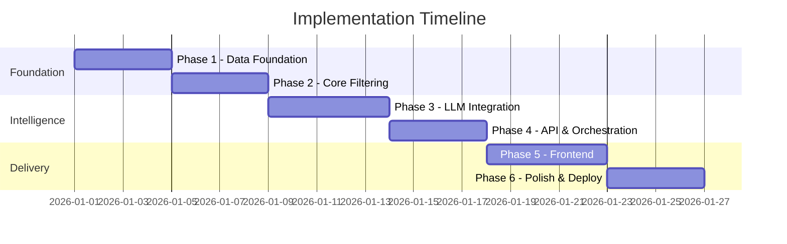
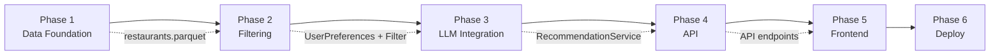

# Implementation Plan: AI-Powered Restaurant Recommendation System

This document provides a phase-wise implementation plan for building the Zomato-inspired restaurant recommendation service. It is derived from [problem_Statement.md](./problem_Statement.md) and [architecture.md](./architecture.md).

---

## Table of Contents

1. [Project Overview](#1-project-overview)
2. [Timeline Summary](#2-timeline-summary)
3. [Prerequisites](#3-prerequisites)
4. [Phase 1: Project Setup & Data Foundation](#phase-1-project-setup--data-foundation)
5. [Phase 2: Domain Models & Core Filtering](#phase-2-domain-models--core-filtering)
6. [Phase 3: LLM Integration & Prompt Engineering](#phase-3-llm-integration--prompt-engineering)
7. [Phase 4: API & Recommendation Orchestration](#phase-4-api--recommendation-orchestration)
8. [Phase 5: Frontend & User Experience](#phase-5-frontend--user-experience)
9. [Phase 6: Testing, Polish & Deployment](#phase-6-testing-polish--deployment)
10. [Cross-Phase Dependencies](#10-cross-phase-dependencies)
11. [Testing Strategy](#11-testing-strategy)
12. [Risk Register](#12-risk-register)
13. [Success Criteria](#13-success-criteria)
14. [Appendix: Problem Statement Traceability](#14-appendix-problem-statement-traceability)

---

## 1. Project Overview

### Goal

Build an application that takes user dining preferences, filters a real Zomato dataset, uses an LLM to rank and explain matches, and presents results in a user-friendly format.

### Core Pattern

**Retrieve → Filter → Reason → Present**

### Workflow Mapping

| Problem Statement Stage | Implementation Phase(s) |
|------------------------|---------------------------|
| 1. Data Ingestion | Phase 1 |
| 2. User Input | Phase 2, Phase 5 |
| 3. Integration Layer | Phase 2, Phase 3 |
| 4. Recommendation Engine | Phase 3, Phase 4 |
| 5. Output Display | Phase 5 |

### Technology Choices (MVP)

| Layer | Choice |
|-------|--------|
| Language | Python 3.11+ |
| Data | Hugging Face `datasets`, pandas |
| Backend | FastAPI |
| Frontend | Streamlit |
| LLM | Groq (`qwen/qwen3.8-27b`; OpenAI / Ollama optional) |
| Validation | Pydantic v2 |

---

## 2. Timeline Summary

| Phase | Name | Duration | Cumulative |
|-------|------|----------|------------|
| **Phase 1** | Project Setup & Data Foundation | 3–4 days | Week 1 |
| **Phase 2** | Domain Models & Core Filtering | 3–4 days | Week 1–2 |
| **Phase 3** | LLM Integration & Prompt Engineering | 4–5 days | Week 2 |
| **Phase 4** | API & Recommendation Orchestration | 3–4 days | Week 2–3 |
| **Phase 5** | Frontend & User Experience | 4–5 days | Week 3 |
| **Phase 6** | Testing, Polish & Deployment | 3–4 days | Week 4 |

**Total estimated duration:** 4 weeks (20–22 working days)



---

## 3. Prerequisites

Complete these before starting Phase 1:

| Item | Details |
|------|---------|
| **Python environment** | Python 3.11+ with virtual environment (`venv` or `conda`) |
| **LLM API key** | Groq account + `GROQ_API_KEY` (OpenAI / Ollama optional) |
| **Git repository** | Initialized repo with `.gitignore` (exclude `.env`, `data/`) |
| **IDE / editor** | VS Code, Cursor, or PyCharm |
| **Network access** | Required for Hugging Face dataset download (~574 MB) |

### Environment Variables (`.env`)

```env
LLM_PROVIDER=groq            # Phase 3 default — groq | openai | ollama
GROQ_API_KEY=gsk-...         # required for Groq
OPENAI_API_KEY=sk-...        # optional alternate provider
LLM_MODEL=qwen/qwen3.8-27b
MAX_CANDIDATES=30
TOP_N_DEFAULT=5
```

---

## Phase 1: Project Setup & Data Foundation

**Duration:** 3–4 days  
**Problem statement coverage:** Data Ingestion  
**Architecture components:** `DatasetLoader`, `Preprocessor`, `CacheManager`

### Objectives

- Establish project structure and tooling
- Download and preprocess the Zomato dataset from Hugging Face
- Cache cleaned data locally for fast reloads
- Validate data quality and schema

### Tasks

#### 1.1 Project Scaffolding

- [x] Create folder structure per [architecture.md §9](./architecture.md#9-project-structure)
- [x] Add `requirements.txt` with core dependencies:
  ```
  datasets, pandas, fastapi, uvicorn, streamlit,
  openai, pydantic, pydantic-settings, python-dotenv, pytest, ruff
  ```
- [x] Add `.env.example` and `.gitignore`
- [x] Create `src/config/settings.py` for environment-based configuration
- [x] Add initial `README.md` with setup instructions

#### 1.2 Dataset Exploration

- [x] Load raw dataset: `ManikaSaini/zomato-restaurant-recommendation`
- [x] Inspect columns, data types, null counts, and sample rows
- [x] Document raw-to-internal field mapping in code comments or a short data dictionary
- [x] Identify cities, cuisine formats, and cost/rating field names

#### 1.3 Data Loader & Preprocessor

- [x] Implement `src/data/loader.py` — fetch dataset via Hugging Face `datasets`
- [x] Implement `src/data/preprocessor.py`:
  - Drop rows missing name, location, or rating
  - Parse cuisine strings into lists
  - Normalize location strings (trim, title-case)
  - Convert cost fields to integers
  - Clamp ratings to 0.0–5.0
  - Deduplicate by name + location
  - Assign unique `id` per restaurant
- [x] Implement `src/data/cache.py` — save/load processed data as Parquet

#### 1.4 Data Preparation Script

- [x] Create `scripts/prepare_data.py` — one-time CLI to download, preprocess, and cache
- [x] Output cached file to `data/processed/restaurants.parquet`

#### 1.5 Unit Tests

- [x] `tests/test_preprocessor.py` — null handling, cuisine parsing, deduplication
- [x] `tests/test_cache.py` — save/load round-trip

### Deliverables

| Deliverable | Location |
|-------------|----------|
| Project scaffold | Root directory |
| Processed dataset cache | `data/processed/restaurants.parquet` |
| Data pipeline modules | `src/data/` |
| Preparation script | `scripts/prepare_data.py` |
| Unit tests | `tests/test_preprocessor.py` |

### Acceptance Criteria

- [x] Running `python scripts/prepare_data.py` completes without errors
- [x] Cached Parquet contains unique valid restaurants after quality filters (raw dump is ~51k listing rows; unique name+location count is lower)
- [x] Each record has: `id`, `name`, `location`, `cuisines`, `average_cost_for_two`, `rating`
- [x] App startup loads cached data in < 5 seconds (no re-download)
- [x] All Phase 1 unit tests pass

### Exit Checkpoint

> **Demo:** Run prepare script, show sample of 5 cleaned records, confirm unique cities and cuisine counts.

---

## Phase 2: Domain Models & Core Filtering

**Duration:** 3–4 days  
**Problem statement coverage:** User Input (backend), Integration Layer (filtering)  
**Architecture components:** `Restaurant`, `UserPreferences`, `RestaurantFilter`

### Objectives

- Define typed domain models for restaurants and user preferences
- Implement deterministic filtering before LLM calls
- Expose metadata (locations, cuisines) for UI dropdowns

### Tasks

#### 2.1 Domain Models

- [x] Implement `src/models/restaurant.py`:
  ```python
  Restaurant(id, name, location, cuisines, average_cost_for_two, rating, votes, ...)
  ```
- [x] Implement `src/models/preferences.py`:
  ```python
  UserPreferences(location, budget, cuisine, min_rating, additional_preferences, top_n)
  ```
- [x] Implement `src/models/recommendation.py` (stub for Phase 3):
  ```python
  Recommendation(rank, restaurant_id, name, cuisine, rating, estimated_cost, explanation)
  RecommendationResponse(recommendations, summary, source)
  ```
- [x] Add Pydantic validators for budget enum, rating range (0–5), top_n (1–10)

#### 2.2 Budget Normalization

- [x] Implement budget-to-cost mapping in `src/config/settings.py`:

  | Budget | Cost for Two (INR) |
  |--------|-------------------|
  | Low | ≤ 500 |
  | Medium | 501 – 1,500 |
  | High | > 1,500 |

#### 2.3 Restaurant Filter

- [x] Implement `src/filters/restaurant_filter.py`:
  1. Location match (case-insensitive, partial)
  2. Minimum rating threshold
  3. Budget range
  4. Cuisine match (if specified)
  5. Sort by rating desc, votes desc
  6. Limit to top 30 candidates
- [x] Return empty list gracefully when no matches

#### 2.4 Metadata Extraction

- [x] Implement helper to extract unique locations and cuisines from dataset
- [x] Sort and deduplicate for UI dropdown population

#### 2.5 Unit Tests

- [x] `tests/test_filter.py`:
  - Location filtering (exact and partial match)
  - Budget tier boundaries
  - Cuisine filtering
  - Min rating threshold
  - Candidate cap at 30
  - Empty result when no match

### Deliverables

| Deliverable | Location |
|-------------|----------|
| Domain models | `src/models/` |
| Filter module | `src/filters/restaurant_filter.py` |
| Budget config | `src/config/settings.py` |
| Filter tests | `tests/test_filter.py` |

### Acceptance Criteria

- [x] Filter returns correct results for: `Bangalore + medium + Italian + rating ≥ 4.0`
- [x] Filter returns ≤ 30 candidates, sorted by rating
- [x] Invalid preferences raise validation errors (missing location, bad budget)
- [x] Metadata helper returns sorted unique locations and cuisines
- [x] All Phase 2 unit tests pass

### Sample Test Queries

| Location | Budget | Cuisine | Min Rating | Expected |
|----------|--------|---------|------------|----------|
| Bangalore | medium | Italian | 4.0 | Non-empty, all Italian-ish, cost 501–1500 |
| Delhi | low | Any | 3.5 | Empty on this HF dump (Bangalore-only); locality queries like Koramangala work |
| Mumbai | high | Chinese | 4.5 | May be empty — handle gracefully |
| InvalidCity | medium | Any | 3.0 | Empty list |

### Exit Checkpoint

> **Demo:** Run filter against 3 sample preference sets in a notebook or CLI; print candidate count and top 5 names.

---

## Phase 3: LLM Integration & Prompt Engineering

**Duration:** 4–5 days  
**Problem statement coverage:** Integration Layer (prompting), Recommendation Engine  
**Architecture components:** `LLMClient`, `PromptBuilder`, `ResponseParser`, fallback ranking

### Objectives

- Abstract LLM providers behind a common interface
- Build prompts that produce structured, ranked recommendations with explanations
- Parse and validate LLM JSON output
- Implement rule-based fallback when LLM fails

### Tasks

#### 3.1 LLM Client Abstraction

- [x] Implement `src/llm/client.py` — abstract `LLMClient` interface with `generate(prompt) -> str`
- [x] Implement `src/llm/providers/groq_provider.py` (primary)
- [x] Implement `src/llm/providers/openai_provider.py` (optional alternate)
- [x] Implement `src/llm/providers/ollama_provider.py` (local dev fallback)
- [x] Wire provider selection via `LLM_PROVIDER` env var (default: `groq`)

#### 3.2 Prompt Builder

- [x] Implement `src/llm/prompt_builder.py`:
  - System prompt: role, rules, JSON schema instructions
  - User prompt: serialized preferences + compact candidate JSON
  - Include budget range text, additional preferences, top_n
- [x] Keep candidate payload compact (id, name, cuisine, rating, cost only)

#### 3.3 Response Parser

- [x] Implement `src/llm/response_parser.py`:
  - Parse JSON from LLM response
  - Validate against `RecommendationResponse` schema
  - Handle markdown code fences in response
  - Retry once on parse failure with format reminder

#### 3.4 Rule-Based Fallback

- [x] Implement fallback in `src/services/recommendation_service.py` (or separate module):
  - Sort filtered candidates by rating
  - Return top N with template explanation: *"Rated {rating}/5 and fits your {budget} budget in {location}."*
  - Set `source: "fallback"` in response

#### 3.5 Prompt Iteration & Quality Testing

- [x] Test with 5+ diverse preference combinations
- [x] Verify LLM only recommends from candidate list (no hallucinated restaurants)
- [x] Verify explanations reference user preferences
- [x] Tune temperature (0.3–0.5) for consistent ranking
- [x] Document final prompts in code or `Docs/prompts.md`

#### 3.6 Unit Tests

- [x] `tests/test_prompt_builder.py` — prompt contains preferences and candidates
- [x] `tests/test_response_parser.py` — valid JSON, malformed JSON, fenced JSON
- [x] `tests/test_fallback.py` — fallback returns valid structure without LLM

### Deliverables

| Deliverable | Location |
|-------------|----------|
| LLM client + providers | `src/llm/` |
| Prompt builder | `src/llm/prompt_builder.py` |
| Response parser | `src/llm/response_parser.py` |
| Fallback logic | `src/services/` |
| Tests | `tests/test_prompt_builder.py`, etc. |

### Acceptance Criteria

- [x] LLM returns valid JSON for ≥ 90% of test queries (after 1 retry)
- [x] Each recommendation includes all 5 output fields (name, cuisine, rating, cost, explanation)
- [x] No hallucinated restaurants (all IDs exist in candidate list)
- [x] Fallback activates correctly when LLM is unavailable
- [x] Optional summary field populated when requested
- [x] All Phase 3 unit tests pass

### Exit Checkpoint

> **Demo:** Submit preferences via a simple CLI script; print ranked recommendations with AI explanations and note whether source is `llm` or `fallback`.

---

## Phase 4: API & Recommendation Orchestration

**Duration:** 3–4 days  
**Problem statement coverage:** Full backend pipeline (all stages except UI)  
**Architecture components:** `RecommendationService`, FastAPI routes

### Objectives

- Orchestrate the full Retrieve → Filter → Reason → Present pipeline
- Expose REST API endpoints for health, metadata, and recommendations
- Add structured error handling and logging

### Tasks

#### 4.1 Recommendation Orchestrator

- [x] Implement `src/services/recommendation_service.py`:
  ```
  1. Load restaurants from cache
  2. Apply RestaurantFilter
  3. If empty → return 404-style empty response
  4. Build prompt → call LLM → parse response
  5. On LLM failure → use fallback
  6. Return RecommendationResponse
  ```

#### 4.2 FastAPI Application

- [x] Implement `src/main.py` — app entry point with lifespan (dataset load on startup)
- [x] Implement `src/api/routes.py`:

  | Method | Endpoint | Purpose |
  |--------|----------|---------|
  | GET | `/health` | Health check + dataset loaded flag |
  | GET | `/api/metadata` | Locations, cuisines, budget options |
  | POST | `/api/recommendations` | Generate recommendations |

#### 4.3 Request / Response Schemas

- [x] Request body matches `UserPreferences`
- [x] Response body matches `RecommendationResponse` with `source` field (`llm` | `fallback`)
- [x] Error responses: 400 (validation), 404 (no matches), 502 (LLM error)

#### 4.4 Error Handling & Logging

- [x] Log filter criteria and candidate count (no PII)
- [x] Log LLM latency and fallback activations
- [x] Global exception handler for unhandled errors

#### 4.5 Integration Tests

- [x] `tests/test_api.py`:
  - `/health` returns 200
  - `/api/metadata` returns non-empty locations
  - `/api/recommendations` with valid input returns recommendations
  - Invalid input returns 400
  - No-match query returns 404

### Deliverables

| Deliverable | Location |
|-------------|----------|
| Orchestrator service | `src/services/recommendation_service.py` |
| FastAPI app | `src/main.py`, `src/api/routes.py` |
| Integration tests | `tests/test_api.py` |
| OpenAPI docs | Auto-generated at `/docs` |

### Acceptance Criteria

- [x] `uvicorn src.main:app --reload` starts without errors
- [x] Dataset loads once on startup; subsequent requests use in-memory data
- [x] POST `/api/recommendations` returns ≤ `top_n` recommendations with explanations
- [x] API response time < 10s for typical LLM call (excluding cold start)
- [x] Swagger UI accessible at `/docs`
- [x] All Phase 4 integration tests pass

### Exit Checkpoint

> **Demo:** Call all three endpoints via curl or Swagger UI; show full JSON recommendation response.

---

## Phase 5: Frontend & User Experience

**Duration:** 4–5 days  
**Problem statement coverage:** User Input, Output Display  
**Architecture components:** Streamlit UI, preference form, recommendation cards

### Objectives

- Build a user-friendly interface to collect preferences and display results
- Implement loading, empty, and error states
- Display all required output fields per recommendation

### Tasks

#### 5.1 Streamlit App Shell

- [x] Create `app/streamlit_app.py` — main entry point
- [x] Page config: title, icon, layout (`wide`)
- [x] App header and brief instructions

#### 5.2 Preference Form

- [x] Implement `app/components/preference_form.py` (or inline in main app):
  - Location — dropdown populated from `/api/metadata` or direct data load
  - Budget — radio or select (`low`, `medium`, `high`)
  - Cuisine — optional dropdown
  - Minimum rating — slider (0.0–5.0, default 3.0)
  - Additional preferences — free-text area
  - Top N — number input (default 5)
  - Submit button

#### 5.3 Recommendation Display

- [x] Implement `app/components/recommendation_card.py`:
  - Rank badge
  - Restaurant name (heading)
  - Cuisine, rating (with stars), estimated cost
  - AI-generated explanation (highlighted block)
  - Optional summary section at top

#### 5.4 API Integration

- [x] Connect form submit to `POST /api/recommendations` (via `httpx` or direct service call)
- [x] Show spinner during LLM processing
- [x] Handle and display API errors (400, 404, 502)

#### 5.5 UX States

- [x] **Initial state:** Form visible, no results
- [x] **Loading state:** Spinner with "Finding restaurants for you..."
- [x] **Success state:** Recommendation cards ranked 1–N
- [x] **Empty state:** "No restaurants match your criteria. Try broadening your search."
- [x] **Error state:** Friendly message with retry option

#### 5.6 Styling (Optional)

- [x] Basic CSS via `st.markdown` for card layout
- [x] Color-coded rating badges
- [x] Responsive layout for smaller screens
- [x] Stitch DineMind white-light theme (`Docs/design/stitch/`, `app/styles/dinemind.css`)

### Deliverables

| Deliverable | Location |
|-------------|----------|
| Streamlit app | `app/streamlit_app.py` |
| UI components | `app/components/` |
| Run command documented | README |

### Acceptance Criteria

- [x] User can select location, budget, cuisine, and rating from the UI
- [x] Submitting the form displays top N recommendations
- [x] Each card shows: name, cuisine, rating, cost, AI explanation
- [x] Loading spinner appears during API call
- [x] Empty and error states display appropriate messages
- [x] App runs via `streamlit run app/streamlit_app.py`

### Exit Checkpoint

> **Demo:** Full user walkthrough — enter preferences for Bangalore + medium + Italian, submit, review ranked cards with explanations.

---

## Phase 6: Testing, Polish & Deployment

**Duration:** 3–4 days  
**Problem statement coverage:** End-to-end validation of all objectives  
**Architecture components:** Full system, deployment, documentation

### Objectives

- Validate the complete system end-to-end
- Harden error handling and performance
- Document setup and usage
- Deploy a demo-ready version

### Tasks

#### 6.1 End-to-End Testing

- [ ] Manual E2E test script covering 10 scenarios:

  | # | Scenario | Expected |
  |---|----------|----------|
  | 1 | Happy path — popular city + common cuisine | 5 ranked results with explanations |
  | 2 | Narrow filters — high budget + high rating | Fewer but quality results |
  | 3 | No matches — obscure city | Empty state message |
  | 4 | Missing cuisine — "Any" | Results across cuisines |
  | 5 | Additional preferences — "family-friendly" | Explanations mention family-friendly |
  | 6 | LLM unavailable — invalid API key | Fallback results with `source: fallback` |
  | 7 | Edge case — min rating 5.0 | Very few or empty results |
  | 8 | Edge case — top_n = 1 | Single recommendation |
  | 9 | Edge case — top_n = 10 | Up to 10 recommendations |
  | 10 | Invalid input — missing location | Validation error in UI |

#### 6.2 Performance Tuning

- [ ] Warm dataset cache on app startup (avoid lazy load delay)
- [ ] Limit LLM candidates to 30 (verify token usage < 4K input)
- [ ] Add timeout on LLM calls (30s max)
- [ ] Measure and log p95 response time

#### 6.3 Security Hardening

- [ ] Confirm `.env` is in `.gitignore`
- [ ] Sanitize free-text `additional_preferences` (max 500 chars)
- [ ] Review prompt for injection resistance

#### 6.4 Documentation

- [ ] Update `README.md`:
  - Project overview
  - Prerequisites
  - Setup steps (venv, pip install, prepare data, configure .env)
  - How to run API and Streamlit
  - Example API request/response
  - Architecture link
- [ ] Ensure `.env.example` is complete

#### 6.5 Deployment (Demo)

- [ ] Choose deployment target:
  - **Streamlit Cloud** (simplest for MVP demo), or
  - **Railway / Render** for FastAPI + Streamlit
- [ ] Configure environment variables on host
- [ ] Include pre-built `restaurants.parquet` in deploy artifact OR run prepare script in build step
- [ ] Verify deployed app with a live test query

#### 6.6 Final Code Quality

- [ ] Run `ruff check src/ tests/`
- [ ] Run full test suite: `pytest tests/ -v`
- [ ] Remove debug prints and dead code

### Deliverables

| Deliverable | Location |
|-------------|----------|
| E2E test results | Document in PR or test log |
| README | `README.md` |
| Deployed demo | URL in README |
| Clean codebase | All tests passing, lint clean |

### Acceptance Criteria

- [ ] All 10 E2E scenarios pass
- [ ] Full pytest suite passes
- [ ] README enables a new developer to run the app in < 15 minutes
- [ ] Demo deployment is accessible and functional
- [ ] All problem statement objectives verified (see §13)

### Exit Checkpoint

> **Demo:** Present deployed app to stakeholders; walk through happy path and one edge case live.

---

## 10. Cross-Phase Dependencies



| Phase | Depends On | Blocks |
|-------|-----------|--------|
| Phase 1 | Prerequisites | Phase 2, 3, 4, 5 |
| Phase 2 | Phase 1 | Phase 3, 4 |
| Phase 3 | Phase 2 | Phase 4 |
| Phase 4 | Phase 3 | Phase 5 |
| Phase 5 | Phase 4 | Phase 6 |
| Phase 6 | Phase 5 | — |

**Parallelization opportunity:** Phase 5 UI mockups (static form layout) can start during Phase 3 while LLM prompts are being tuned, but API integration must wait for Phase 4.

---

## 11. Testing Strategy

| Phase | Test Type | Focus |
|-------|-----------|-------|
| Phase 1 | Unit | Preprocessing, caching |
| Phase 2 | Unit | Filter logic, validation |
| Phase 3 | Unit + Manual | Prompt output, parser, fallback |
| Phase 4 | Integration | API endpoints, orchestrator |
| Phase 5 | Manual | UI flows, UX states |
| Phase 6 | E2E | Full pipeline, deployment |

### Test Coverage Targets (MVP)

| Module | Target |
|--------|--------|
| `preprocessor.py` | ≥ 80% |
| `restaurant_filter.py` | ≥ 90% |
| `response_parser.py` | ≥ 85% |
| `recommendation_service.py` | ≥ 70% |
| API routes | Key paths covered |

---

## 12. Risk Register

| Risk | Impact | Likelihood | Mitigation |
|------|--------|------------|------------|
| Dataset schema differs from expected | High | Medium | Explore raw data in Phase 1 before building models; adapt `SchemaMapper` |
| LLM returns invalid JSON | Medium | Medium | Response parser with retry; rule-based fallback |
| LLM hallucinates restaurants | High | Low–Medium | Constrain prompt: "only from candidate list"; validate IDs in parser |
| High LLM latency (> 15s) | Medium | Medium | Cap candidates at 30; use Groq for faster inference; show loading UI |
| Large dataset slow to filter | Low | Low | In-memory pandas; pre-index by location if needed |
| API key costs exceed budget | Medium | Low | Use GPT-4o-mini; log token usage; cache identical queries (future) |
| No restaurants match narrow filters | Medium | High | Return helpful empty state; suggest broadening criteria |
| Hugging Face download fails | High | Low | Retry logic; document manual download alternative |

---

## 13. Success Criteria

The project is complete when all problem statement objectives are met:

| # | Objective | Verification |
|---|-----------|-------------|
| 1 | Takes user preferences (location, budget, cuisine, ratings) | UI form accepts and validates all fields |
| 2 | Uses real-world Zomato dataset | Data loaded from Hugging Face, ≥ 40K records |
| 3 | LLM generates personalized recommendations | Each result has AI explanation referencing preferences |
| 4 | Displays clear, useful results | Cards show name, cuisine, rating, cost, explanation |
| 5 | Ranks restaurants intelligently | LLM ranking differs from pure rating sort in test cases |
| 6 | Handles edge cases gracefully | Empty results, LLM failure, invalid input all handled |
| 7 | Deployed and demo-ready | Live URL accessible; README documents setup |

---

## 14. Appendix: Problem Statement Traceability

### Data Ingestion → Phase 1

| Requirement | Task |
|-------------|------|
| Load Zomato dataset from Hugging Face | 1.2, 1.3 |
| Extract name, location, cuisine, cost, rating | 1.3 |

### User Input → Phase 2, Phase 5

| Requirement | Task |
|-------------|------|
| Location (Delhi, Bangalore) | 2.1, 5.2 |
| Budget (low, medium, high) | 2.2, 5.2 |
| Cuisine (Italian, Chinese) | 2.1, 5.2 |
| Minimum rating | 2.1, 5.2 |
| Additional preferences | 2.1, 5.2 |

### Integration Layer → Phase 2, Phase 3

| Requirement | Task |
|-------------|------|
| Filter data based on user input | 2.3 |
| Pass structured results to LLM | 3.2 |
| Design ranking prompt | 3.2, 3.5 |

### Recommendation Engine → Phase 3, Phase 4

| Requirement | Task |
|-------------|------|
| Rank restaurants | 3.2, 4.1 |
| Provide explanations | 3.2, 3.3 |
| Summarize choices (optional) | 3.2 |

### Output Display → Phase 5

| Requirement | Task |
|-------------|------|
| Restaurant Name | 5.3 |
| Cuisine | 5.3 |
| Rating | 5.3 |
| Estimated Cost | 5.3 |
| AI-generated explanation | 5.3 |

---

## Quick Reference: Commands

```bash
# Setup
python -m venv venv && source venv/bin/activate
pip install -r requirements.txt
cp .env.example .env          # Add your API keys

# Prepare data (Phase 1)
python scripts/prepare_data.py

# Run tests
pytest tests/ -v

# Run API (Phase 4+)
uvicorn src.main:app --reload --port 8000

# Run UI (Phase 5+)
streamlit run app/streamlit_app.py
```

---

*This plan should be updated as phases complete. Mark checkboxes and note actual vs. estimated durations in PR descriptions or a project tracker.*
